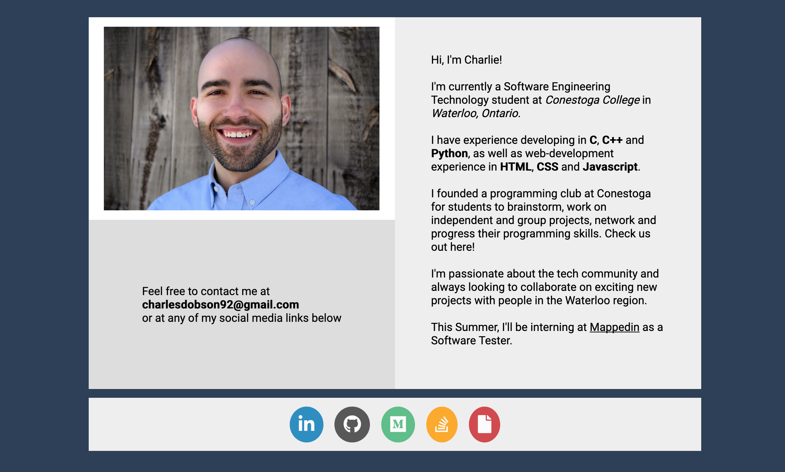

# Personal Website
This is my personal portfolio website. It's a simple splash page with a brief biography and links to my social media pages.

# Motivation
In an attempt to create a better online representation of myself, I decided to build a simple splash page to act as a personal portfolio and provide links to all my social media pages. It is also useful in developing my web development skills (HTML and CSS in particular).

# Build Status
A basic layout has been implemented. 
Things to do:
- Make sure all social media links are functioning
- Improve responsiveness to ensure uniformity for all browsers and devices
- Add additional sections (projects, blog, etc)

# Screenshots

# Tech
**Built With**
- HTML
- CSS

# License
MIT © Charles Dobson